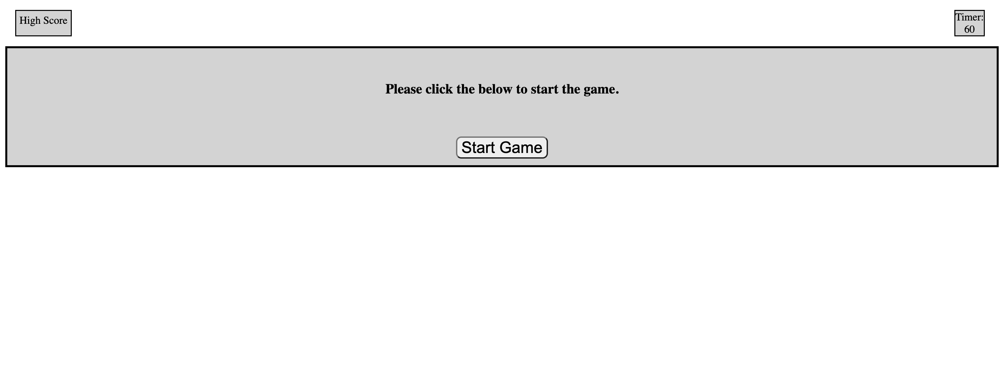

# Code-Quiz
A JavaScript fundamentals quiz

## Description
A Quiz Game application

## Usage
When the page loads the user will be presented with a home page that prompts them to start their game. When the start button is clicked the user will be presented with a series of questions and a 60 second countdown will begin. When the user answers a question with the correct answer, they will move on to the next question. If the user answers the question incorrectly, the countdown will be subtracted by 3 seconds. If the user answers the question correctly, they will move on to the next question without suffering any time penalty. When the user answers each question, the game will end and they will be prompted to enter their name to save their score and restart the game if they so choose. If the user runs out time (the timer reaches "0") the game will end and they will be prompted to either enter their name with a score of "0" or restart the game for a better score. If the user would like to compare the scores of past participants, they can click the "High Score" button to see those scores.

## Screenshot

.png)
.png)
.png)
